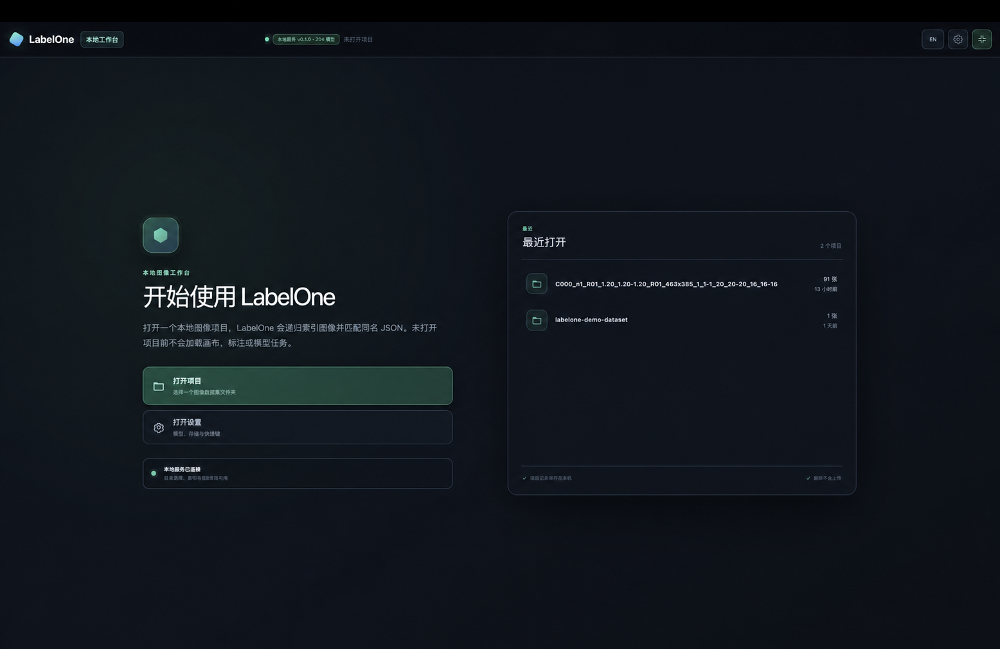

<div align="center">
  
  <h1>LabelOne</h1>
  <p><strong>A local-first workspace for visual datasets, annotation, image pipelines, and AI-assisted review.</strong></p>

  <p>
    <a href="./README.md">English</a> ·
    <a href="./README.zh-CN.md">简体中文</a>
  </p>

  <p>
    <a href="./LICENSE"></a>
    
    
    
    
    
    <a href="https://github.com/YounkHo/LabelOne/stargazers"></a>
  </p>

  <p>
    <a href="#demo">Demo</a> ·
    <a href="#highlights">Highlights</a> ·
    <a href="#quick-start">Quick Start</a> ·
    <a href="#models-and-network">Models</a> ·
    <a href="#development">Development</a> ·
    <a href="#star-history">Star History</a>
  </p>
</div>

<p align="center">
  
</p>

LabelOne keeps the high-frequency parts of visual-data work in one desktop-style web interface: browse datasets, create and review annotations, build non-destructive image pipelines, run ONNX models, inspect intermediate features, and compare multiple synchronized views. The local service owns indexing, atomic annotation saves, background jobs, model lifecycle, and large-image tiles; the browser owns the interactive canvas.

> LabelOne is under active development and currently targets a local, single-user workflow. Try it on a copy of your data first.

## Demo

https://github.com/user-attachments/assets/c0e75997-4880-45cc-b94e-bd133829a345

## Highlights

### 1. Resolve ambiguous edges with visual evidence — Available

High-precision annotation often depends on deciding exactly where a weak or noisy boundary lies. LabelOne lets you compare or overlay classical image-processing results with AI intermediate feature maps in synchronized views, so boundary decisions can be supported by multiple forms of visual evidence instead of the raw image alone.

### 2. Understand data and model behavior — Available

Inspect spatial feature maps, tokens, vectors, or matrices from supported ONNX layers. Intermediate representations can be added to a processing flow and viewed beside the source image, helping reveal what the model responds to and where its evidence diverges from human interpretation.

### 3. Import automated optimization pipelines as one node — Available

Existing annotation or image-optimization automation can be packaged behind LabelOne's operator contract: a manifest, Python entrypoint, parameter Schema, and explicit annotation policy. After inspection and installation, the complete external routine appears in the Workflow as a single reusable node.

### 4. Align suggestions with human preferences through RL — Roadmap

The planned reinforcement-learning loop will learn from annotation corrections while work is happening, using human decisions to continuously align model suggestions and boundary preferences. This capability is not included in the current release yet.

### More capabilities

| Area | What LabelOne provides |
| --- | --- |
| Dataset workspace | Recursive image/JSON discovery, separate image and annotation roots, virtualized navigation, and persistent indexing |
| Annotation | Rectangle, rotated box, polygon, point, two-click line, circle, and open freehand line tools with undo/redo and atomic saves |
| Non-destructive workflows | Image processing without overwriting source files; annotations remain editable and follow declared geometric transforms |
| Multi-view analysis | Single, split, and overlay modes with synchronized zoom, pan, cursor, annotations, and pixel inspection |
| AI-assisted review | ONNX inference, grouped predictions, and one-click promotion from AI predictions to manual annotations |
| Frequency and large-image tools | Fourier/Haar operators, Deep Zoom tiles, and optional libvips/pyvips TIFF/WSI region decoding |
| Local jobs | Persistent pipeline, inference, download, pause/resume, retry, and restart-recovery workflows |

## Quick Start

### Requirements

- macOS or Linux. On Windows, use Git Bash/WSL or start the frontend and backend manually.
- Node.js `22.13.0` or newer.
- pnpm, uv, Git, and curl.

```bash
git clone https://github.com/YounkHo/LabelOne.git labelone
cd labelone

pnpm install --frozen-lockfile
cd server && uv sync --extra dev && cd ..

./scripts/dev-local.sh
```

Open:

- Web workspace: <http://localhost:3000>
- API health check: <http://127.0.0.1:8766/api/v1/health>

Press `Ctrl+C` to stop both processes. The first launch prepares the model catalog metadata in the ignored `.runtime/` directory. If that network step fails, dataset, annotation, and pipeline features remain available.

### Manual startup

Use two terminals from the repository root when you want separate logs:

```bash
# Terminal 1
pnpm run dev:server
```

```bash
# Terminal 2
pnpm run dev:web
```

The web interface needs the local API for file selection, persistence, models, and jobs.

## Open a Dataset

Choose **Open** and select the image directory. LabelOne recognizes both common layouts:

```text
dataset/                     dataset/
├── a.png                    ├── images/a.png
├── a.json                   └── annotations/a.json
├── nested/b.jpg
└── nested/b.json
```

When images and annotations live separately, set the annotation root in the workspace. Files are paired by relative path and matching stem. Pipeline previews never overwrite source images.

## Models and Network

Model weights are not bundled with the repository. Use the model picker to search the catalog; installed weights load automatically, while missing weights require an explicit download confirmation.

Application settings include:

- **Models & Storage** — model directory and preferred GitHub, ModelScope, or Hugging Face source.
- **System & Network** — system proxy, direct connection, or a manual HTTP(S) proxy. Restart the local service after changing proxy settings.
- **AI Service** — an OpenAI-compatible Chat Completions endpoint, model ID, timeout, and credential environment-variable name. Credential values are read only from the service environment.

Useful overrides:

```bash
LABELONE_MODEL_WEIGHTS_DIR=/path/to/model-weights \
LABELONE_DATA_DIR=/path/to/labelone-data \
./scripts/dev-local.sh
```

### HYPIR-SD2 (optional)

The model library includes a HYPIR-SD2 entry, but LabelOne never downloads or executes its third-party runtime implicitly. HYPIR is restricted to non-commercial use unless you obtain written permission from SupPixel. It also requires NVIDIA CUDA, the official HYPIR checkout, a separate Python 3.10 / Torch 2.6 environment, a local Stable Diffusion 2.1 Base snapshot, and `HYPIR_sd2.pth`.

After preparing those files, start LabelOne with:

```bash
LABELONE_HYPIR_PYTHON=/path/to/hypir-env/bin/python \
LABELONE_HYPIR_ROOT=/path/to/HYPIR \
LABELONE_HYPIR_SD21_BASE=/path/to/stable-diffusion-2-1-base \
LABELONE_HYPIR_SD2_WEIGHT=/path/to/HYPIR_sd2.pth \
./scripts/dev-local.sh
```

Follow the [official HYPIR repository](https://github.com/XPixelGroup/HYPIR) for environment and weight preparation. Without a complete runtime or CUDA, the catalog entry remains visible but explicitly unavailable. Restored 1–8× images open as an independent canvas source instead of being treated as same-size mask overlays.

By default the API listens only on `127.0.0.1`, and images are not uploaded automatically. Remote inference or a cloud AI service makes network requests only after it is configured and selected.

## Project Layout

```text
app/                  Web UI, canvas interactions, and frontend domain logic
server/src/labelone/  FastAPI service, datasets, models, pipelines, jobs, and Agent
server/tests/         Backend test suite
scripts/              Local launcher and repository utilities
docs/assets/          README media
```

## Development

```bash
pnpm run lint
pnpm run build
pnpm run test:server
```

For a production-style local run, start the API with Uvicorn and run `pnpm start` after `pnpm build`.

Optional high-performance TIFF/WSI decoding requires the system `libvips` library and a compatible `pyvips` package in the server environment. Without them, LabelOne uses a bounded Pillow fallback.

## Troubleshooting

- **Node version error** — upgrade Node.js or set `LABELONE_NODE=/absolute/path/to/node`.
- **pnpm or uv is missing** — install the tool or set `LABELONE_PNPM` / `LABELONE_UV`.
- **API did not become ready on port 8766** — check port usage and the backend log, then open the health-check URL.
- **The UI shows offline** — make sure both the web process and local API are running.
- **Models are visible but unavailable** — model weights are downloaded separately from the source repository.
- **Proxy or model-directory changes do not apply** — restart the local service.
- **A large TIFF exceeds the pixel budget** — install libvips and pyvips, then restart.

## Contributing

Issues and pull requests are welcome. For substantial changes, open an issue first so the data contract, UI behavior, and test scope can be agreed on before implementation.

## License

LabelOne source code is licensed under the [Apache License 2.0](./LICENSE). Model weights, datasets, operator packages, and other third-party components remain subject to their own licenses and distribution terms.

## Star History

<a href="https://github.com/YounkHo/LabelOne/stargazers">
  <picture>
    <source media="(prefers-color-scheme: dark)" srcset="https://raw.githubusercontent.com/YounkHo/LabelOne/star-history/star-history-dark.svg" />
    <source media="(prefers-color-scheme: light)" srcset="https://raw.githubusercontent.com/YounkHo/LabelOne/star-history/star-history.svg" />
    
  </picture>
</a>

<p align="center"><sub>Generated daily by this repository's GitHub Actions workflow using the GitHub API.</sub></p>

## Support LabelOne

If LabelOne is useful to you, consider starring the repository. It helps more visual-data practitioners discover the project.

<a href="https://github.com/YounkHo/LabelOne/stargazers"></a>
